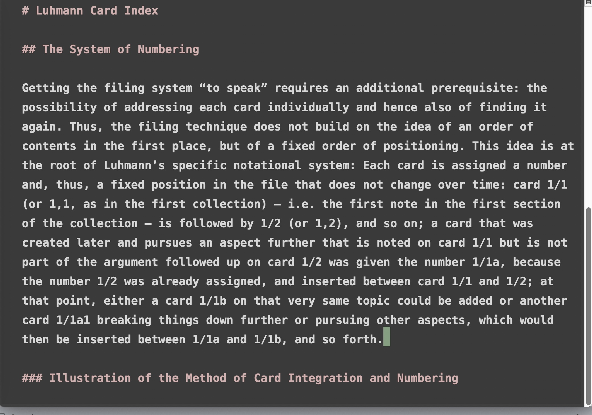

## Simulate padding left for Micro Editor from existing Zenburn color scheme.

To have a padding left space in the Micro Editor this colorscheme uses the line number left column with the same background color than the main area
and the line number itself also with the same color as the background. This helps to create a distraction free environement. You would not see line numbers though, but for distraction free purposes who cares?

## Install and use

* Create the folder: `~/.config/micro/colorschemes`
* Copy the file `freedelta.micro` inside
* Open Micro Editor and click Ctrl + E then type `set colorscheme freedelta`

## Other writing distraction free settings

Click Ctrl + E before each line:

* `set softwrap true`
* `set wordwrap true`
* `set tabstospaces true`
* `set statusline false`

